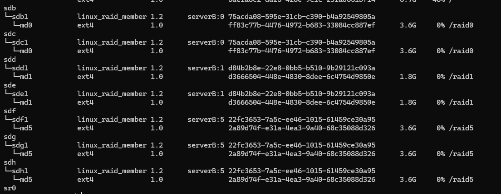

# Linux Software RAID 0·1·5 구축

## 1. 실습 목표

Linux Software RAID를 이용해 RAID 0, RAID 1, RAID 5를 직접 구성하고,
RAID 논리 장치에 파일시스템을 생성한 뒤 디렉터리에 마운트하여 정상 동작을 확인

---

## 2. 실습 환경

- OS: Ubuntu Linux
- 실행 환경: VMware
- 사용 도구: `mdadm`
- 파일시스템: `ext4`
- 실습용 디스크: 2GB × 7개

---

## 3. 구성

RAID 0: sdb1 + sdc1 → md0 → ext4 → /raid0

RAID 1: sdd1 + sde1 → md1 → ext4 → /raid1

RAID 5: sdf1 + sdg1 + sdh1 → md5 → ext4 → /raid5

---

## 4. 핵심 명령어

### 4-1. 디스크 및 파티션 확인

```bash
lsblk -f
```

RAID에 사용할 디스크와 파티션이 정상적으로 인식되었는지 확인

---

### 4-2. RAID 생성

#### RAID 0

```bash
sudo mdadm --create /dev/md0 \
  --level=0 \
  --raid-devices=2 \
  /dev/sdb1 /dev/sdc1
```

#### RAID 1

```bash
sudo mdadm --create /dev/md1 \
  --level=1 \
  --raid-devices=2 \
  /dev/sdd1 /dev/sde1
```

#### RAID 5

```bash
sudo mdadm --create /dev/md5 \
  --level=5 \
  --raid-devices=3 \
  /dev/sdf1 /dev/sdg1 /dev/sdh1
```

`mdadm --create`를 이용해 여러 디스크 파티션을 하나의 RAID 논리 장치로 구성

---

### 4-3. RAID 상태 확인

```bash
sudo mdadm --detail /dev/md0
sudo mdadm --detail /dev/md1
sudo mdadm --detail /dev/md5
```

RAID Level, 구성 디스크 수, Active/Working/Failed Devices 등의 상태를 확인

RAID 5에서는 다음 상태를 확인

```text
State : clean
Active Devices : 3
Working Devices : 3
Failed Devices : 0
```

---

### 4-4. 파일시스템 생성

```bash
sudo mkfs.ext4 /dev/md0
sudo mkfs.ext4 /dev/md1
sudo mkfs.ext4 /dev/md5
```

개별 디스크가 아니라 RAID로 생성된 `/dev/md*` 논리 장치에 `ext4` 파일시스템을 생성

---

### 4-5. 마운트 지점 생성

```bash
sudo mkdir /raid0
sudo mkdir /raid1
sudo mkdir /raid5
```

---

### 4-6. RAID 마운트

```bash
sudo mount /dev/md0 /raid0
sudo mount /dev/md1 /raid1
sudo mount /dev/md5 /raid5
```

RAID 논리 장치의 파일시스템을 각각의 디렉터리에 연결

---

## 5. 검증

### RAID 및 파일시스템 전체 구조 확인

```bash
lsblk -f
```

최종적으로 다음 구조가 정상적으로 생성된 것을 확인

```text
sdb1 + sdc1       → md0 → ext4 → /raid0
sdd1 + sde1       → md1 → ext4 → /raid1
sdf1 + sdg1 + sdh1 → md5 → ext4 → /raid5
```

### 마운트 확인

```bash
findmnt /raid0
findmnt /raid1
findmnt /raid5
```

각 RAID 장치가 지정한 디렉터리에 정상적으로 마운트된 것을 확인

---

## 6. Evidence

### 최종 RAID 구성

`lsblk -f` 결과에서 RAID 0, RAID 1, RAID 5의 논리 장치와
각 파일시스템 및 마운트 위치를 확인한 화면 첨부.


<!-- 예:  -->

---

## 7. Troubleshooting

<!-- <현재 RAID 구축 과정에서 발생한 단순 명령어 오타는 제외> -->

<!-- RAID 장애 및 복구 실습에서 의미 있는 장애 원인 분석과 복구 과정이 발생하면 이 문서에 추가 -->

---

## 8. Learned

- RAID는 `mdadm`을 이용해 여러 디스크를 하나의 논리적 블록 장치로 구성할 수 있다.
- RAID를 구성하는 디스크 각각에 파일시스템을 생성하는 것이 아니라, RAID 생성 후 만들어진 하나의 논리적 저장장치에 파일시스템을 생성한다.
- RAID 장치도 일반 블록 장치와 동일하게 파일시스템 생성 후 디렉터리에 마운트해야 실제 파일 저장 공간으로 사용할 수 있다.
- RAID Level에 따라 디스크를 사용하는 방식과 장애 내성이 달라진다.
- RAID 구성 후에는 `mdadm --detail`, `lsblk -f`, `findmnt` 등을 이용해 구성과 상태를 검증할 수 있다.