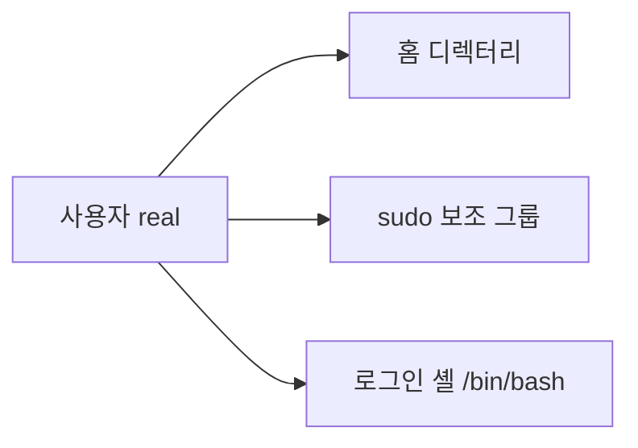
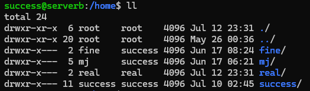
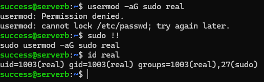

# 사용자 계정 관리

## 1. 실습 목표

Linux 사용자 계정 생성 후 홈 디렉터리·보조 그룹·로그인 셸 적용 상태 확인

## 2. 실습 환경

- Ubuntu Linux VM

## 3. 구성



## 4. 핵심 구현

```bash
id real                         # 동일 사용자 존재 여부 확인
sudo useradd -m real            # 사용자와 홈 디렉터리 생성
sudo passwd real                # 비밀번호 설정
sudo usermod -aG sudo real      # 기존 그룹 유지 + sudo 보조 그룹 추가
sudo usermod -s /bin/bash real  # 로그인 셸 변경
su real                         # 사용자 전환
```

## 5. 검증

- `real` 사용자와 홈 디렉터리 생성 확인
- 비밀번호 설정 후 사용자 전환 확인
- `id real`에서 `sudo` 그룹 포함 확인
- 로그인 셸 변경 명령 적용

## 6. Evidence





## 7. 배운점

- `useradd -m`: 사용자와 홈 디렉터리 생성
- `usermod -aG`: 기존 보조 그룹 유지 후 그룹 추가
- `usermod -s`: 로그인 셸 변경
- 사용자·그룹 관리 작업은 관리자 권한이 필요한 경우가 많음
- 명령어가 기억나지 않을 때 `--help`로 필요한 옵션 확인

## 관련 기록

