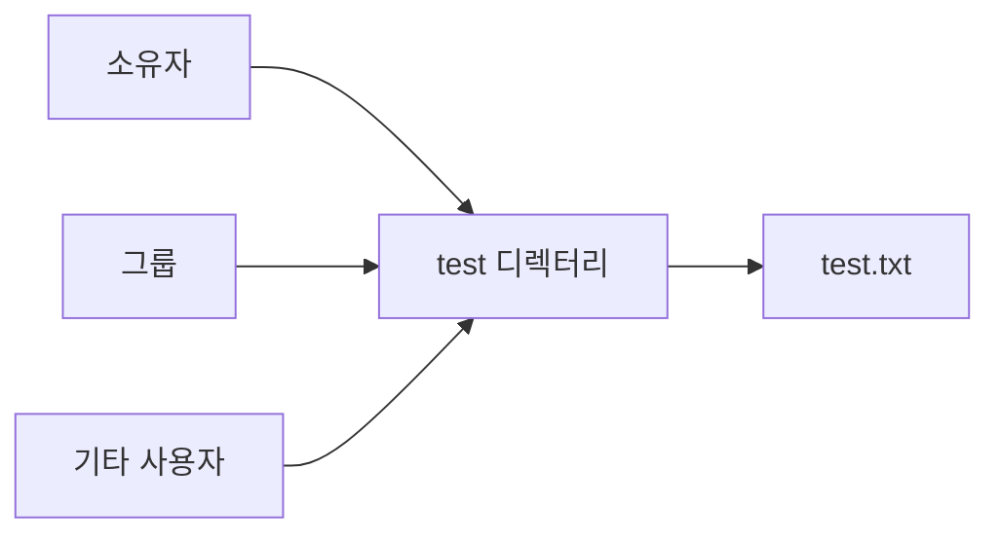
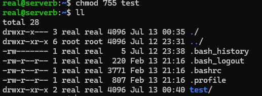
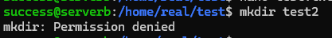
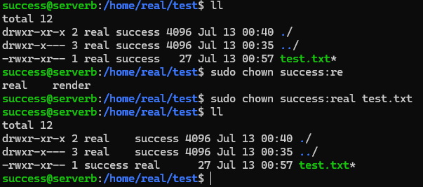

# 파일 및 디렉터리 권한 관리

## 1. 실습 목표

파일·디렉터리 권한과 소유권을 변경하고 다른 사용자 기준의 접근·수정 범위 검증

## 2. 실습 환경

- Ubuntu Linux VM
- 실습용 사용자 계정 다수

## 3. 구성



## 4. 핵심 구현

```bash
ls -la                                  # 권한·소유자·그룹 확인
chmod 755 test                          # 디렉터리 권한 변경
su <다른사용자>                         # 다른 사용자 기준 접근 확인
chmod 752 test.txt                      # 파일 권한 변경
sudo chown success:real test.txt        # 파일 소유자·그룹 변경
```

상위 디렉터리의 소유권·권한도 변경해 하위 항목 생성·삭제·이름 변경 가능 여부 확인.

## 5. 검증

- `ls -la`로 변경된 권한·소유자·그룹 확인
- 다른 사용자 계정의 디렉터리 접근 가능 여부 확인
- 디렉터리 쓰기 권한이 없을 때 하위 항목 생성 제한 확인
- 상위 디렉터리 소유권·권한 변경 후 하위 항목 관리 가능 여부 확인

## 6. Evidence







## 7. 배운점

- 디렉터리 `r`: 항목 목록 조회
- 디렉터리 `x`: 경로 접근
- 디렉터리 `w + x`: 하위 항목 생성·삭제·이름 변경에 필요
- 기존 파일 내용 수정은 파일 자체 권한도 함께 영향
- 파일 권한만 보지 않고 상위 디렉터리 권한까지 확인 필요
- `chown 사용자:그룹 대상`: 소유자와 그룹 동시 변경

## 관련 기록

