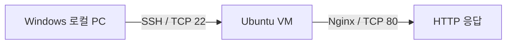

# SSH와 Nginx 서버 운영

## 1. 실습 목표

Ubuntu VM에 SSH와 Nginx를 구성하고 서비스·포트·방화벽·로그·HTTP 응답 확인

## 2. 실습 환경

- Ubuntu Linux VM
- Windows 로컬 PC
- OpenSSH
- Nginx
- UFW

## 3. 구성



## 4. 핵심 구현

```bash
ip a                                      # VM IPv4 확인
sudo apt update                           # 패키지 목록 갱신
sudo apt install openssh-server           # SSH 서버 설치
sudo systemctl start ssh                  # SSH 서비스 시작
sudo systemctl enable ssh                 # 부팅 시 자동 시작
sudo systemctl status ssh                 # SSH 상태 확인
sudo ss -tulnp | grep ':22'               # 22/TCP LISTEN 확인
sudo ufw status numbered                  # UFW 규칙 확인
sudo ufw allow 22/tcp                     # SSH 허용

sudo apt install nginx                    # Nginx 설치
sudo systemctl start nginx                # Nginx 서비스 시작
sudo systemctl enable nginx               # 부팅 시 자동 시작
sudo systemctl status nginx               # Nginx 상태 확인
sudo ss -tulnp | grep ':80'               # 80/TCP LISTEN 확인
sudo ufw allow 80/tcp                     # HTTP 허용

curl http://localhost                     # 로컬 HTTP 응답 확인
journalctl -u ssh -n 50                   # SSH journal 확인
journalctl -u nginx -n 50                 # Nginx journal 확인
```

> `journalctl -u nginx`는 서비스 기동·오류 로그 확인. HTTP 요청별 access log와는 구분.

## 5. 검증

- SSH 서비스 `active` 확인
- 22/TCP `LISTEN` 확인
- Nginx 서비스 `active` 확인
- 80/TCP `LISTEN` 확인
- `curl http://localhost` HTTP 응답 확인
- UFW 규칙 수정 후 Windows 로컬 PC에서 SSH 접속 정상화 확인

## 6. Troubleshooting

SSH 22/TCP 허용 규칙이 있어도 접속 실패 발생.
IPv4/IPv6 규칙과 기존 `DENY` 규칙 순서를 확인하고 충돌 규칙 제거 후 정상화.

- [상세 기록: SSH 접속 장애 분석 및 UFW 방화벽 설정 수정](<../../05-Troubleshooting/01-리눅스/01 SSH 접속 장애 분석 및 UFW 방화벽 설정 수정.md>)

## 7. 배운점

- 서비스 `active`만으로 외부 접속 가능 여부 판단 불가
- 원격 접속 점검: `서비스 → LISTEN 포트 → 방화벽 → 실제 접속`
- UFW IPv4/IPv6 규칙 별도 확인 필요
- 동일 포트에 허용·차단 규칙이 함께 있으면 적용 순서 확인 필요
- `journalctl -u <service>` 기반 서비스 로그 확인

## 관련 기록

