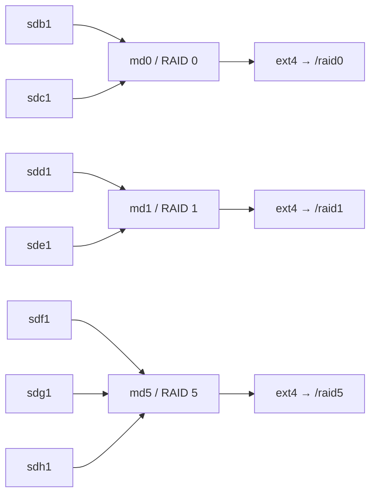

# RAID 구성 및 검증

## 1. 실습 목표

`mdadm`으로 RAID 0·1·5를 구성하고 파일시스템 생성·마운트·상태 검증

## 2. 실습 환경

- Ubuntu Linux
- VMware VM
- `mdadm`
- `ext4`
- 실습용 디스크: 2GB × 7개

## 3. 구성



## 4. 핵심 구현

```bash
sudo mdadm --create /dev/md0 --level=0 --raid-devices=2 /dev/sdb1 /dev/sdc1
sudo mdadm --create /dev/md1 --level=1 --raid-devices=2 /dev/sdd1 /dev/sde1
sudo mdadm --create /dev/md5 --level=5 --raid-devices=3 /dev/sdf1 /dev/sdg1 /dev/sdh1

sudo mkfs.ext4 /dev/md0
sudo mkfs.ext4 /dev/md1
sudo mkfs.ext4 /dev/md5

sudo mkdir /raid0
sudo mkdir /raid1
sudo mkdir /raid5

sudo mount /dev/md0 /raid0
sudo mount /dev/md1 /raid1
sudo mount /dev/md5 /raid5
```

## 5. 검증

```bash
sudo mdadm --detail /dev/md0
sudo mdadm --detail /dev/md1
sudo mdadm --detail /dev/md5
lsblk -f
findmnt /raid0
findmnt /raid1
findmnt /raid5
```

RAID 5 확인 결과:

```text
State : clean
Active Devices : 3
Working Devices : 3
Failed Devices : 0
```

최종 구조는 `3. 구성`의 Mermaid 다이어그램과 동일.
## 6. Evidence


## 7. 배운점

- 여러 디스크 파티션을 `/dev/md*` RAID 논리 장치로 구성
- 파일시스템은 개별 멤버가 아니라 RAID 논리 장치에 생성
- RAID 장치도 파일시스템 생성 후 마운트해야 사용 가능
- RAID 레벨별 디스크 사용 방식과 장애 내성 차이 확인
- `mdadm --detail`, `lsblk -f`, `findmnt`로 구성·상태 검증

## 관련 기록

- [RAID 장애 분석 및 복구](<../../05-Troubleshooting/01-리눅스/02 RAID 장애 분석 및 복구.md>)
