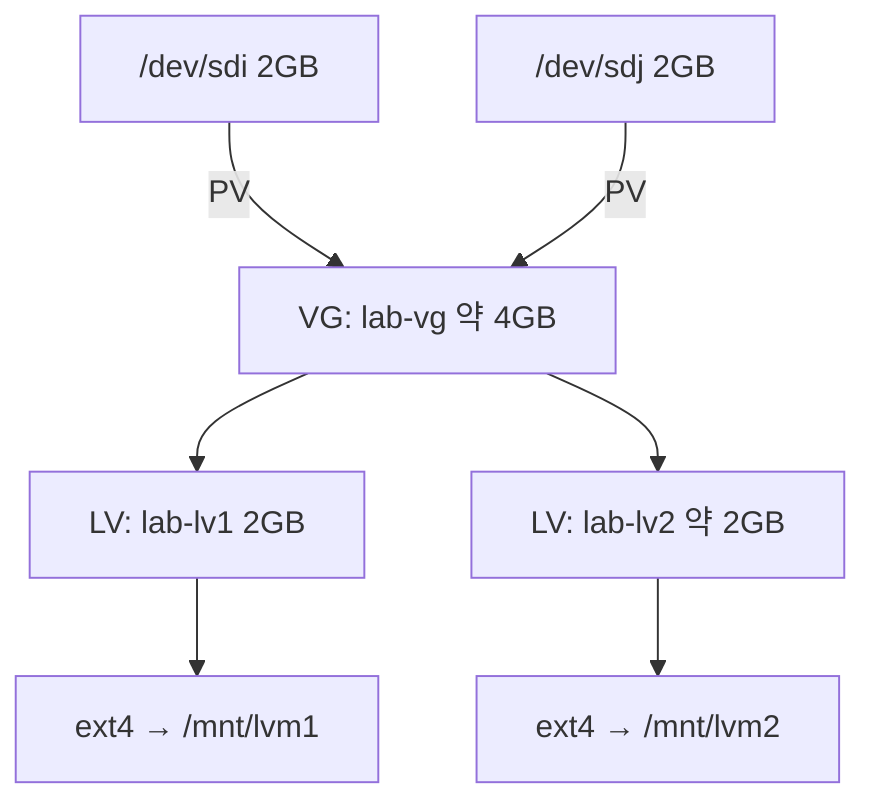

# LVM 구성 및 확장

## 1. 실습 목표

LVM (Logical Volume Manager, 논리 볼륨 관리자)으로 저장공간을 구성하고 논리 볼륨·파일시스템 확장 검증

## 2. 실습 환경

- VMware Ubuntu Linux VM
- 추가 가상 디스크: `/dev/sdi` 2GB, `/dev/sdj` 2GB

## 3. 구성



## 4. 핵심 구현

```bash
sudo pvcreate /dev/sdi /dev/sdj             # PV 초기화
sudo vgcreate lab-vg /dev/sdi /dev/sdj      # VG 구성
sudo lvcreate -L 1G -n lab-lv1 lab-vg       # LV 생성

sudo mkfs.ext4 /dev/lab-vg/lab-lv1
sudo mkdir -p /mnt/lvm1
sudo mount /dev/lab-vg/lab-lv1 /mnt/lvm1

sudo lvextend -L +1G /dev/lab-vg/lab-lv1    # LV 1GB → 2GB
sudo resize2fs /dev/lab-vg/lab-lv1          # ext4 파일시스템 확장

sudo lvcreate -l 100%FREE -n lab-lv2 lab-vg # 남은 VG 공간 전체 사용
sudo mkfs.ext4 /dev/lab-vg/lab-lv2
sudo mkdir -p /mnt/lvm2
sudo mount /dev/lab-vg/lab-lv2 /mnt/lvm2
```

`lvextend`, `resize2fs`는 강의 외 추가 실습.

## 5. 검증

```bash
sudo pvs
sudo vgs
sudo lvs
lsblk -f
df -h
```

확인 결과:

- `/dev/sdi`, `/dev/sdj`의 `lab-vg` 소속 확인
- `lab-vg` 약 3.99GB 확인
- `lab-lv1` 2GB, `lab-lv2` 약 1.99GB 확인
- 두 LV의 `ext4` 파일시스템과 마운트 확인
- `lab-lv1` 확장 후 파일시스템 약 2GB 확인

## 6. 배운점

- LVM 기본 구조: `PV → VG → LV → 파일시스템 → 마운트`
- VG는 여러 PV를 하나의 저장공간 Pool로 결합
- LV 확장 후 파일시스템 크기도 별도 확장·확인 필요
- `100%FREE`: VG 남은 공간 전체 할당
- VG 여유 공간 부족 시 새 PV 추가 후 확장 가능
- RAID는 장애 내성·성능, LVM은 논리적 공간 관리·확장이 핵심

## 관련 기록

