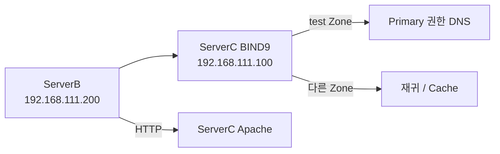

# BIND9 재귀·캐싱 DNS 및 Primary 권한 DNS 구축

> 공개 기록에서는 실습에 사용한 임시 도메인명을 `test`로 치환.

## 1. 실습 목표

BIND9으로 재귀·캐싱 DNS와 Primary 권한 DNS를 구성하고 DNS 조회, 캐싱, 권한 응답, 웹 서비스 연결까지 검증.

## 2. 실습 환경

| 구분 | ServerC | ServerB |
|---|---|---|
| IP | `192.168.111.100/24` | `192.168.111.200/24` |
| Gateway | `192.168.111.2` | `192.168.111.2` |
| DNS | `8.8.8.8` | `192.168.111.100` |
| 역할 | BIND9 / Apache | DNS Client |

- VMware NAT: `192.168.111.0/24`
- DHCP Pool: `192.168.111.128 ~ 192.168.111.254`

## 3. 구성



## 4. 핵심 구현

### ServerC 고정 IP

```yaml
network:
  version: 2
  ethernets:
    ens32:
      dhcp4: false
      dhcp6: false
      addresses:
        - 192.168.111.100/24
      routes:
        - to: default
          via: 192.168.111.2
      nameservers:
        addresses:
          - 8.8.8.8
```

### ServerB 고정 IP 및 DNS

```yaml
network:
  version: 2
  ethernets:
    ens32:
      dhcp4: false
      dhcp6: false
      addresses:
        - 192.168.111.200/24
      routes:
        - to: default
          via: 192.168.111.2
      nameservers:
        addresses:
          - 192.168.111.100
```

Netplan 검사:

```bash
sudo netplan generate
sudo netplan try
```

### BIND9 설치

```bash
sudo apt install bind9 bind9-dnsutils
```

### Primary Zone 등록

`/etc/bind/named.conf.local`

```conf
zone "test" {
    type primary;
    file "/etc/bind/db.test";
};
```

### Zone 파일

`/etc/bind/db.test`

```dns
$TTL 3H

@   IN  SOA  @  root.test. (
        2
        1D
        1H
        1W
        1H
)

@       IN  NS  @
@       IN  A   192.168.111.100
www     IN  A   192.168.111.100
ftp     IN  A   192.168.111.200
```

설정 검사 및 적용:

```bash
sudo named-checkconf
sudo named-checkzone test /etc/bind/db.test
sudo systemctl restart bind9
systemctl is-active bind9
```

### Apache

```bash
sudo apt install -y apache2
sudo systemctl enable --now apache2
```

## 5. 검증

### 재귀·캐싱 DNS

```bash
dig @192.168.111.100 naver.com
```

동일 질의 2회 실행 결과:

```text
1차: Query time 510 ms / TTL 300
2차: Query time   1 ms / TTL 218
```

Cache 동작 확인.

### Primary 권한 DNS

```bash
dig @192.168.111.100 www.test
dig @192.168.111.100 ftp.test
```

확인:

```text
www.test → 192.168.111.100
ftp.test → 192.168.111.200
aa 플래그 확인
```

등록하지 않은 레코드:

```bash
dig @192.168.111.100 abc.test
```

확인:

```text
NXDOMAIN
aa 플래그
```

### OS 기본 DNS 경로

ServerB:

```bash
dig www.test
```

```text
ServerB
→ 127.0.0.53 Stub Resolver
→ 192.168.111.100
→ ServerC BIND9
→ test Zone
```

### 웹 서비스 연결

ServerB:

```bash
curl http://www.test
```

DNS 이름을 이용한 Apache 접속 정상 확인.

## 6. Evidence

- BIND9 `active (running)`
- `named-checkzone` → `OK`
- 캐싱 전후 Query time `510 ms → 1 ms`
- TTL `300 → 218`
- `www` → `192.168.111.100`
- `ftp` → `192.168.111.200`
- 권한 응답 `aa` 확인
- 미등록 이름 `NXDOMAIN` 확인
- ServerB에서 DNS 이름으로 Apache 접속 성공

## 7. Troubleshooting

### Netplan Route 구조 오류

잘못된 구조:

```yaml
routes:
  - to: default
  - via: 192.168.111.2
```

`to`와 `via`가 서로 다른 Route로 해석됨.

수정:

```yaml
routes:
  - to: default
    via: 192.168.111.2
```

### BIND 검사 대상 혼동

`named.conf.local`을 `named-checkzone`으로 검사해 오류 발생.

```bash
named-checkconf
# BIND 설정 검사

named-checkzone test /etc/bind/db.test
# Zone 데이터 검사
```

### ServerC에서 실습 도메인 접속 실패

ServerC의 OS DNS가 `8.8.8.8`로 설정되어 있어 로컬 BIND9의 실습 Zone을 조회하지 못함.

```text
ServerC → 127.0.0.53 → 8.8.8.8
```

IP `192.168.111.100`으로 직접 접속 시 DNS 조회 없이 Apache 연결 정상 확인.

ServerB는 DNS가 `192.168.111.100`으로 설정되어 있어 이름으로 정상 접속.

## 8. 배운점

- 고정 IP를 사용하는 DNS 서버 구성 흐름 확인
- BIND9에서 재귀·캐싱과 Primary 권한 DNS 동작 검증
- `dig @DNS_IP`로 특정 DNS 서버 직접 검증 가능
- `aa` 플래그로 권한 응답 확인
- 관리 Zone에 없는 이름은 `NXDOMAIN` 응답
- DNS 이름 해석부터 실제 웹 서비스 연결까지 검증
- 설정 변경 시 `문법 검사 → 적용 → 상태 확인 → 기능 검증` 순서 적용